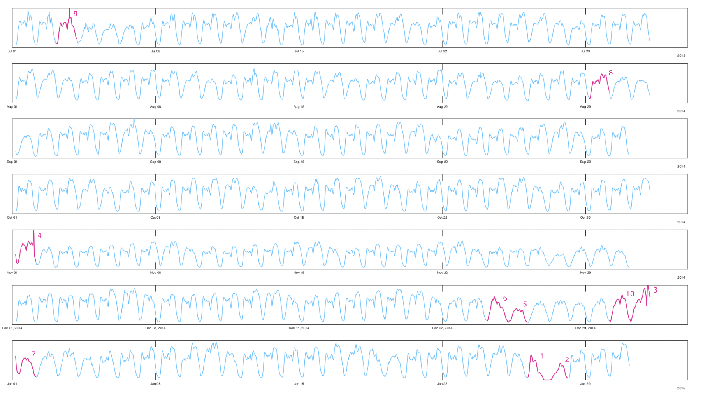

# METRIC

**METRIC** is a framework for machine learning based on the concept of metric spaces, which makes it possible to combine arbitrary data types. METRIC is written in modern C++ to provide the best performance and provides Python bindings.

Here is an anomaly detection example:


Here are two visualizations, how to computation in and with metric spaces work.


# Intro example

```cpp
#include <metric/metric.hpp>


int main()
{	
    using namespace metric;
    using namespace std;
    // some data
    vector<vector<int>> A = {
        { 0, 1, 1, 1, 1, 1, 2, 3 },
        { 1, 1, 1, 1, 1, 2, 3, 4 },
        { 2, 2, 2, 1, 1, 2, 0, 0 },
        { 3, 3, 2, 2, 1, 1, 0, 0 },
        { 4, 3, 2, 1, 0, 0, 0, 0 },
        { 5, 3, 2, 1, 0, 0, 0, 0 },
        { 4, 6, 2, 2, 1, 1, 0, 0 },
    };
	
    // some other data
    deque<string> B = {
        "this",
        "test",
        "tests",
        "correlation",
        "of",
        "arbitrary",
        "data",
    };

	
    // bind the types and corresponding metrics with a constructor
    auto mgc_corr = MGC<Euclidean<vector<int>>, Edit<string>>();

    // compute the correlation
    double result = mgc_corr(A, B);

    cout << "Multi-scale graph correlation: " << result << endl;
    // 0.0791671 (Time = 7.8e-05s)
    // Rows 2 and 3 are similar in both data sets, so that there is a minimal correlation.

    return 0;
}
```
# Installation

## Cmake install
1. Download and unpack [last release](https://github.com/panda-official/metric/releases/latest)
1. Run cmake install (replace `{latest}` for your version)
```shell
cd metric-{latest}
mkdir build && cd build
cmake .. && make install
```
# Integration 
## Using cmake target
```cmake
find_package(panda_metric REQUIRED)

add_executable(program program.cpp)
target_link_libraries(program panda_metric::panda_metric)

# metric use blaze as linear algebra library which expects you to have a LAPACK library installed
# (it will still work without LAPACK and will not be reduced in functionality, but performance may be limited)
find_package(LAPACK REQUIRED)
target_link_libraries(program ${LAPACK_LIBRARIES})
```
## Include headers
Main header for whole metric library:
```cpp
#include <metric/metric.hpp>
```
You also could use module specific header:
```cpp
#include <metric/mapping.hpp>
```
## Python bindings
You can install it as Python lib with `pip`.
```
python -m pip install metric-py -i https://test.pypi.org/simple/
```
Check out the Python subdirectory for more helps and system requirements.

# Short introduction

## General Concept
A metric space is defined by a set of records (aka elements, observations, points etc.) and a corresponding metric, which is a distance function with special requirements that can compares records pair-wise about similarity. 

Almost all algorithms of this framework operate on metric spaces. However, in most situations, it is not necessary to build such a metric space explicit.

You just need to configure the algorithm implicitly with the metric for your data.

All algorithms in the METRIC framework are designed to be used in a two-phase approach. First, the algorithm must be configured with the metric and - if also required - training data or additional parameters. After the construction, the object can be used.

```cpp
using namespace metric;

using rec_t = std::vector<double>;

std::vector<rec_t> A = {
        { 0, 1, 1, 1, 1, 1, 2, 3 },
        { 1, 1, 1, 1, 1, 2, 3, 4 },
        { 2, 2, 2, 1, 1, 2, 0, 0 },
        { 3, 3, 2, 2, 1, 1, 0, 0 },
        { 4, 3, 2, 1, 0, 0, 0, 0 },
        { 5, 3, 2, 1, 0, 0, 0, 0 },
        { 4, 6, 2, 2, 1, 1, 0, 0 }}; // a set with seven records

rec_t b = { 2, 8, 2, 1, 0, 0, 0, 0 }; // a single record.

Algorithm<Euclidean<rec_t>> algo(A,2); // configure an algorithm with euclidean metric, training data and an additional parameter

auto result1 = algo(b); // apply the default method
auto result2 = algo.estimate(b); // apply a special method
```
## Explicit metric spaces
METRIC provides three classes to build explicit metric space (DistanceMatrix, KNNGraph and SearchTree). All classes provide the same methods, but they have different computational advantages.

```cpp
DistanceMatrix<Manhatten<rec_t>> dMat(A); // build a full pair-wise representation
KNNGraph<Manhatten<rec_t> knnG(A); // build a local and sparse representation
SearchTree<Manhatten<rec_t>> sTree(A); // build a hierarchical organized tree representation

auto distance = dMat(0,3) // accessing the distance value by IDs.
auto nn_ID = sTree.nn(b); //searching for the best matching record of b in the metric space (aka next neighbor)
```

There are two main scenarios, where it makes sense to use explict metric spaces.
1) When you want to find the best matching record or subsets
2) when you want to update your metric space in realtime and want to keep the distance computations updated incrementally.

## Distance functions

There is a hugh collection of distance function in METRIC available, but you can also use your own functions. The Distance functions library is organized in three groups (random, related and structured). This framework provides only real metric and pseudo-metric, (also known as semi-metrics), that fulfill the triangle inequality.

https://en.wikipedia.org/wiki/Metric_(mathematics)


### Random metrics 
The corresponding indices of two records are not related to each other. Also, the records can have a different sizes. This is normally the case, when the values of a record represent random observations of one dimension.
```
Record 1    [1.3, 7.2, 5.8, 7.3, 2.7, 5.5 ...]
Record 2    [2.1, 6.2, 1.2, 6.2, 2.5  ...]
```

### related metrics 
The values of two records are related, when the order of the indices can be changed without effecting the result of the distance computation. This is normally the case, when each index of a record represents a dimension and the value represents one observation. The dimensions are regarded as independent to each other in principle. In comparison to the random metrics, different samples are provided by the records and not by the values in one record.
```
Record 1    [1.3, 7.2, 5.8, 7.3, 2.7, 5.5, ...]
              |    |    |    |    |    |   
Record 2    [2.1, 6.2, 1.2, 6.2, 2.5, 4.2, ...]
```


### k-structured metrics
When the indices in a record have a structural meaning like the bin position in a histogram or the pixel position in a picture, you normally use a structured metric. Here the known dependency of the dimension is used for better results.
```
Record 1    [1.3, 7.2, 5.8, 7.3, 2.7, 5.5, ...]
             |  X |  X |  X |  X | |  X |
Record 2    [2.1, 6.2, 1.2, 6.2, 2.5, 4.2, ...]
```
In the most case, you will configure an algorithm with a distance function, but of course you can construct and use a distance function manually.
```cpp
rec_t a = { 1, 2, 5, 3, 1 };
rec_t b = { 2, 2, 1, 3, 2 };

auto distance_function = P_norm<rec_t>(1.5); //configure a Minkowski metric with p=1.5

double result = distance_function(a, b); //apply the metric
```
It's easy to provide and use your own metric. To do so, you have to define a struct with a methods that overloads the ()-operator, and you have to provide the inner value type as Val_T.
```cpp
struct user_euclidean {
    using Val_T = double; // necessary template line.
    double operator()(std::vector<double> a, std::vector<double> b) // overload the ()-operator 
        {
        /* start of implementation */
        double sum=0;
        for (int i =0; i< a.size(); i++){
                sum += std::pow(a[i]-b[i],2);
        }
        return std::sqrt(sum);
        /* end of implementation*/
    }
};
```

## Computing with metric spaces

 Each data set to which a matching metric is assigned, is already a metric space by definition. So you don't have to compute metric spaces explicitly, and normally you can use the algorithms with common data input. 

```cpp
std::vector<std::string> B = {
        "this",
        "is",
        "a",
        "vector",
        "of",
        "strings"}; // a set with six records
auto entropy = Entropy<Edit<std::string>>(); //configure the entropy computation

double result = entropy(B); // compute the entropy

```

The meaning of entropy for a metric spaces is different from the classical shannon entropy, that is discrete. The entropy in METRIC is based on the concept of differential entropy and has the meaning of a local degree of freedom in the dataset. It can be regarded alternatively as mean intrinsic dimensionality over the space, no matter how many real dimensions are provided.

Anyway, like correlation in the intro example the entropy gives only an information about the existence of a dependencies in the data. To model this dependency you have to apply one of the provided feature extractors mechanisms. 

Imaging a setting, where you take a colored 400x300 photos of a scene at random time. In this scene only a door is opened and closed in some intermediate states. All pixels can change from photo to photo, but there are actually only two independent things happening, the door opening angle and the lighting setup show variations. We call this kind of intrinsic dimensionality "features". While the original record has 400*300*3 = 360000 dimension, it has only 2 intrinsic dimension.

It is important to understand, that the concept of metrics space is only applicable, when the amount of recorded dimensions are highly correlated to each other and the intrinsic dimensions are not increasing with the number of records. If this is the case, the curse of dimensionality will prevent any analysis or insights. But that is not a limit of the metric space concept. It is a limit at all.

The methods to extract features are also known as dimension reduction techniques. But this name is a little misguiding, because we are not changing the recorded dimension, we are extracting only the underlying features that lead to the recorded dimensions and put them in a new metric space. Or in other word, we filter out the most important information to make further processing easier and to break down complicated dependencies to a human understanding like a 2d-information.

The most aggressive feature extractor is called clustering. Here a metric space is split into several similar groups and only a categorical liable is mapped as feature.

```cpp
auto [data, lables] = loadDataSet("NYC_taxi")
auto cluster = KOC<TWED<rec_t>>(data); //configure the clustering

auto lable = cluster(data[0]); // apply the clustering to first sample
```

A less aggressive feature extraction is archived with a continuous mapper. 

```cpp
auto [data, lables] = loadDataSet("MNIST");
auto f_extractor = Autoencoder<SSIM<rec_t>>(data); //configure the clustering

auto features = f_extractor(data[0]); // apply the feature extraction to the first sample
```

When you find correlations between metric spaces, you can model them with continuous mappers. For example, you first extract deterministic features of a picture, then map this space to its denoised manifold and measure the distance to the manifold as outliner distance and then approximate the solution with a neural network for faster computation.

```cpp
using namespace metric;
using namespace std;
using Container = std::vector;
Container<Image> data = loadDataSet("Donuts");

auto hog_extractor = HOG(data[0].width, data[0].hight); // setup histogram of oriented gradients feature extractor

Container<vector<double>> histograms = hog_extractor(data); // compute the histograms

auto outliner_model = Rediff<Euclidean<vector<double>>>(histograms); // compute the manifold of the histogram space

Container<double> outliners = outliner_model(histograms); // compute the outline distance for all images

auto model = ESN<Image,double> (data, outliners); // train an approximation model

model.save("myModel.cereal")
```
then load and apply the model:
```cpp
auto model = ESN<Image,double>("myModel.cereal");
double outliner_score = model(Img1); // compute the outline score for an image
```


# Why METRIC is awesome

** METRIC** extends the capabilities of machine
learning algorithms for variable structured data
types and enables statements to be made about the
relationships between the data in the context of
artificial intelligence. For this purpose, the
recorded data is first modeled using a metric in a
metric space. These spaces can now be related to
each other and simplified without loss of
information. This allows essential information to be
extracted and accessible to the user. In various
modules, the framework offers a collection of
algorithms that are optimized for metric spaces and
accessible via a standardized API. 
 
**PANDA | METRIC** is located in the area of machine learning and artificial intelligence, 
but offers more than a loose collection of optimized and high class algorithms, 
because PANDA | METRIC combines these different algorithms seamless. 
Data Science is no magic, it is all about information theory, statistics and optimization methods and PANDA | METRIC provides 
all you need to generate data-driven added values. All algorithms in data science seems like a huge loosely 
connected family. This framework provides a universal approach that makes it easy to combine these techniques. 
This framework brings all these algorithms under the theory of metric spaces together and guides, how to combine them.  

**METRIC** is programmed in modern and template based C++, which allows a comfortable use with
optimal performance at the same time. Compared
to the approach of neural networks, the concept of metric spaces offers considerable advantages especially for industrial applications.

# Full documentation
**[Modules Overview](metric/README.md)**

* **[METRIC | DISTANCE](metric/distance/README.md)** 

* **[METRIC | SPACE](metric/space/README.md)** 

* **[METRIC | CORRELATION](metric/correlation/README.md)** 

* **[METRIC | MAPPING](metric/mapping/README.md)** 

* **[METRIC | TRANSFORM](metric/transform/README.md)** 

* **[METRIC | UTILS](metric/utils/README.md)** 

**METRIC** is organized in several submodules. 
 
**METRIC | DISTANCE** provide an extensive collection of metrics,
including factory functions for configuring complex metrics.  
They are organized into several's levels of complexity and a prior knowledge about the data. 
Basically the user give a priori information, how the data should be connected for reason, like 
a picture is a 2d array of pixels. A metric type is basically a function, which compares 
two samples of data and gives back the numeric distance between them.
 
**METRIC | SPACE** stores and organizes distances. It provides classes to connect and relate data that are 
kind of the same observations in principle. And it includes basic operations
such as the search for neighboring elements. If you can compare two entries all entries are automatically 
related through the distance-representations in a metric space. 
 
**METRIC | MAPPING** contains various algorithms that can
‘calculate’ metric spaces or map them into equivalent
metric spaces. 
In general, you can regard all the algorithms in METRIC | MAPPING as mapper from one metric space into 
a new one, usually with the goal to reduce complexity (like clustering or classifying) or to fill missing 
information (like predicting). Also values can be bidirectionally reconstructed from
reduced space using reverse decoder. In addition, unwanted features can be removed from the space
for further evaluation. In this way, the user brings in his
a priori knowledge and understandings. on the other hand
his a priori influence is visible and not causing a loss
of information by an incidental programming of this
knowledge. 
 
**METRIC | TRANSFORM** provides deterministic algorithms that transfer data
element by element into another metric space, e.g. from
the time to the frequency domain.
This is often useful for complexity reduction as preprocessing step. A distinction can be
made between lossy compression and completely reversible
methods. In general, however, these are proven,
deterministic methods such as wavelets or physical motivated fittings.
 
**METRIC | CORRELATION** offers functions
to calculate metric entropy, which gives a measure of intrinsic local dimensionality and the correlation of two metric spaces
and thus to determine the dependency of two arbitrary
data sets. When METRIC | MAPPING is used to quantify and measure 
relations in data, METRIC | CORRELATION is used to find relations between metric spaces at all. 
 
**METRIC | UTILS** contains algorithms which are not
metric either, but which can be easily combined. On the
one hand, there is a high-performance in-memory
crossfilter. This allows a combined filtering of the patterns from the results of the
operations in quasi real time. On the other hand, the METRIC | UTILS
module also contains a nonlinear and nonparametric
significance test for independent features (PMQ) of a
metric space that were obtained by mapping and more.


**FUNCTION CALLS**


**Calls METRIC | DISTANCE**

| Class Description                                  | Language | Constructor                                                             | ()-Operator                       | Default Parameters                                                   |
|----------------------------------------------------|----------|-------------------------------------------------------------------------|-----------------------------------|----------------------------------------------------------------------|
| Sorensen Distance                                  | Python   | f = distance.Sorensen()                                                 | result = f(dataA, dataB)          |                                                                      |
|                                                    | C++      | auto f = metric::Sorensen()                                             | auto result = f(dataA, dataB)     |                                                                      |
| Euclidean Distance Metric                          | Python   | f = distance.Euclidean()                                                | result = f(dataA, dataB)          |                                                                      |
|                                                    | C++      | auto f = metric::Euclidean<double>()                                    | auto result = f(dataA, dataB)     |                                                                      |
| Manhattan Distance Metric                          | Python   | f = distance.Manhatten()                                                | result = f(dataA, dataB)          |                                                                      |
|                                                    | C++      | auto f = metric::Manhatten<double>()                                    | auto result = f(dataA, dataB)     |                                                                      |
| Minkowski (L general) Metric (P_norm)              | Python   | f = distance.P_norm(p=1)                                                | result = f(dataA, dataB)          | defaults: p=1                                                        |
|                                                    | C++      | auto f = metric::P_norm<double>(1)                                      | auto result = f(dataA, dataB)     | defaults: p=1                                                        |
| Euclidean Metric Threshold                         | Python   | f = distance.Euclidean_thresholded(thres=1, factor=3)                   | result = f(dataA, dataB)          | defaults: thres=1000, factor=3000                                    |
|                                                    | C++      | auto f = metric::Euclidean_thresholded<double>(1, 3)                    | auto result = f(dataA, dataB)     | defaults: thres=1000, factor=3000                                    |
| Cosine Metric                                      | Python   | f = distance.Cosine()                                                   | result = f(dataA, dataB)          |                                                                      |
|                                                    | C++      | auto f = metric::Cosine<double>()                                       | auto result = f(dataA, dataB)     |                                                                      |
| Chebyshev Distance Metric (Maximum value distance) | Python   | f = distance.Chebyshev()                                                | result = f(dataA, dataB)          |                                                                      |
|                                                    | C++      | auto f = metric::Chebyshev<double>()                                    | auto result = f(dataA, dataB)     |                                                                      |
| Earth Mover's Distance Metric (EMD)                | Python   | f = distance.EMD(cost_mat, extra_mass_penalty)                          | result = f(dataA, dataB)          | defaults: cost_mat={}, extra_mass_penalty=-1                         |
|                                                    | C++      | auto f = metric::EMD<double>(cost_mat, max_cost)                        | auto result = f(dataA, dataB)     | defaults: extra_mass_penalty=-1                                      |
| Edit Distance Metric                               | Python   | f = distance.Edit()                                                     | result = f("asdsd", "dffdf")      |                                                                      |
|                                                    | C++      | auto f = metric::Edit<char>                                             | auto result = f("asdsd", "dffdf") |                                                                      |
| Structural Similarity Index (SSIM)                 | Python   | f = distance.SSIM(dynamic_range=100, masking=1)                         | result = f(img1, img2)            | defaults: dynamic_range=255, masking=2                               |
|                                                    | C++      | auto f = metric::SSIM<double, std::vector<double>>(100, 1)              | auto result = f(img1, img2)       |                                                                      |
| Time Warp Edit Distance (TWED)                     | Python   | f = distance.TWED(penalty=1, elastic=2)                                 | result = f(dataA, dataB)          | defaults: penalty=0, elastic=1                                       |
|                                                    | C++      | auto f = metric::TWED<double>(1, 2)                                     | auto result = f(dataA, dataB)     |                                                                      |
| Kohonen Distance Metric                            | Python   | f = distance.Kohonen(train_data, w, h)                                  | result = f(sample1, sample2)      | defaults: start_learn_rate=0.8, finish_learn_rate=0.0, iterations=20 |
|                                                    | C++      | auto f = metric::Kohonen<double>(train_data, w, h)                      | auto result = f(sample1, sample2) | defaults: start_learn_rate=0.8, finish_learn_rate=0.0, iterations=20 |
| Riemannian Distance Metric                         | C++      | auto rd = metric::RiemannianDistance<void, metric::Euclidean<double>>() | auto result = rd(ds1, ds2)        | defaults: metric=metric::Euclidean<T>                                |


**Calls METRIC | SPACE**


| Class Description                                                                                                                                                                                                                                                                                                                                                                                                      | Language | Constructor                                        | ()-Operator           | Parameters                                               |
|------------------------------------------------------------------------------------------------------------------------------------------------------------------------------------------------------------------------------------------------------------------------------------------------------------------------------------------------------------------------------------------------------------------------|----------|----------------------------------------------------|-----------------------|----------------------------------------------------------|
| Distance matrix                                                                                                                                                                                                                                                                                                                                                                                                        | Python   | f = space.Matrix(data, Euclidean())                | result = f(i, j)      | Default Parameters: data = {}, metric=Euclidean()        |
| Distance matrix                                                                                                                                                                                                                                                                                                                                                                                                        | C++      | auto f = metric::Matrix<std::vector<double>>(data) | auto result = f(i, j) | constructor defaults: d = Metric() /*template argument*/ |
| A Search Tree works like a std-container to store data of some structure. Basically a Metric Search Tree has the same principle as a binary search tree or a kd-tree, but it works for arbitrary data structures. This Metric Search Tree is basically a Cover Tree Implementation. Additionally to the distance (or similarity) between the data, a covering distance from level to level decides how the tree grows. | Python   | f = space.Tree()                                   | auto result = f(i, j) |                                                          |
|                                                                                                                                                                                                                                                                                                                                                                                                                        | C++      | auto f = metric::Tree<std::vector<double>>()       | auto result = f(i, j) |                                                          |

**Calls METRIC | MAPPING**


| Class Description                                                                                                                                                                                                                                                                                                                                                                                                                                                           | Language | Constructor                                                                                        | ()-Operator                                         | Encode                         | Decode                    | Default Parameters                                                                                                                                                                                              |
|-----------------------------------------------------------------------------------------------------------------------------------------------------------------------------------------------------------------------------------------------------------------------------------------------------------------------------------------------------------------------------------------------------------------------------------------------------------------------------|----------|----------------------------------------------------------------------------------------------------|-----------------------------------------------------|--------------------------------|---------------------------|-----------------------------------------------------------------------------------------------------------------------------------------------------------------------------------------------------------------|
| Domain split principle components compressor                                                                                                                                                                                                                                                                                                                                                                                                                                | Python   | f = mapping.DSPCC(dataset, n_features=1)                                                           | -                                                   | f.encode(data)                 | result = f.decode(codes)  | defaults: n_features=1, n_subbands=4, time_freq_balance=0.5, n_top_features=16                                                                                                                                  |
|                                                                                                                                                                                                                                                                                                                                                                                                                                                                             | C++      | auto f = metric::DSPCC<vector<double>, void>(dataset, 1)                                           |                                                     |                                |                           | defaults: n_features=1, n_subbands=4, time_freq_balance=0.5, n_top_features=16                                                                                                                                  |
| Kohonen Distance Clustering is one of the Neural Network unsupervised learning algorithms. This algorithm is used in solving problems in various areas, especially in clustering complex data sets.                                                                                                                                                                                                                                                                         | Python   | f = mapping.KOC_factory(w, h)                                                                      | koc = f(samples, num_clusters)                      | -                              | -                         | defaults: nodes_width=5, nodes_height=4, anomaly_sigma=1.0, start_learn_rate=0.8, finish_learn_rate=0, iterations=20, distribution_min=-1, distribution_max=1,  min_cluster_size=1, metric=distance.Euclidean() |
|                                                                                                                                                                                                                                                                                                                                                                                                                                                                             | C++      | auto f = mapping::KOC_factory<std::vector<double>, metric::Grid6, metric::Euclidean<double>>(w, h) | auto koc = f(samples, num_clusters)                 | -                              | -                         | defaults: nodes_width=5, nodes_height=4, anomaly_sigma=1.0, start_learn_rate=0.8, finish_learn_rate=0, iterations=20, distribution_min=-1, distribution_max=1,  min_cluster_size=1                              |
| Autoencoder  is an unsupervised artificial neural network that learns how to efficiently compress and encode data then learns how to reconstruct the data back from the reduced encoded representation to a representation that is as close to the original input as possible. It reduces data dimensions by learning how to ignore the noise in the data.                                                                                                                  | Python   | f  = mapping.Autoencoder()                                                                         | -                                                   | result = f.encode(sample)      | result = f.decode(sample) |                                                                                                                                                                                                                 |
|                                                                                                                                                                                                                                                                                                                                                                                                                                                                             | C++      | auto f = metric::Autoencoder<uint8_t, double>()                                                    | -                                                   | auto result = f.encode(sample) | result = f.decode(sample) |                                                                                                                                                                                                                 |
| dbscan (Density-based spatial clustering of applications with noise) is a data clustering  non-parametric algorithm. Given a set of points in some space, it groups together points that are closely packed together (points with many nearby neighbors), marking as outliers points that lie alone in low-density regions (whose nearest neighbors are too far away). DBSCAN is one of the most common clustering algorithms and also most cited in scientific literature. | Python   | f = mapping.dbscan                                                                                 | assignments, seeds, counts = f(matrix, eps, minpts) | -                              | -                         |                                                                                                                                                                                                                 |
| dbscan                                                                                                                                                                                                                                                                                                                                                                                                                                                                      | C++      | auto f = mapping::dbscan<std::vector<double>>                                                      | auto result = f(matrix, eps, minpts)                |                                |                           |                                                                                                                                                                                                                 |
| ESN  (echo state network) is a recurrent neural network with a sparsely connected hidden layer (with typically 1% connectivity). The connectivity and weights of hidden neurons are fixed and randomly assigned                                                                                                                                                                                                                                                             | Python   | f = partial(mapping.ESN(w_size=400).train(slices, target).predict)                                 | result = f(slices)                                  | -                              | -                         | defaults: w_size=500, w_connections=10, w_sr=0.6, alpha=0.5, washout=1, beta=0.5                                                                                                                                |
| ESN                                                                                                                                                                                                                                                                                                                                                                                                                                                                         | C++      | auto f = metric::ESN<std::vector<double>, Euclidean<double>>()                                     | -                                                   | -                              |                           | defaults: w_size=500, w_connections=10, w_sr=0.6, alpha=0.5, washout=1, beta=0.5                                                                                                                                |
| AffProp (Affinity propagation) is a clustering algorithm based on message passing between data points. Similar to K-medoids, it looks at the (dis)similarities in the data, picks one exemplar data point for each cluster, and assigns every point in the data set to the cluster with the closest exemplar.                                                                                                                                                               | Python   | f = mapping.AffProp(preference=1.0, maxiter=100)                                                   | result = f(data)                                    | -                              | -                         | defaults: preference=0.5, maxiter=200, tol=1.0e-6, damp=0.5                                                                                                                                                     |
| AffProp                                                                                                                                                                                                                                                                                                                                                                                                                                                                     | C++      | auto f = mapping::AffProp<std::vector<double>>()                                                   | auto result = f(data)                               |                                |                           | defaults: preference=0.5, maxiter=200, tol=1.0e-6, damp=0.5                                                                                                                                                     |
| kmeans  clustering is a method of vector quantization, that aims to partition n observations into k clusters in which each observation belongs to the cluster with the nearest mean (cluster centers or cluster centroid), serving as a prototype of the cluster.                                                                                                                                                                                                           | Python   | f = partial(mapping.kmeans, maxiter=100, distance_measure='manhatten')                             | result = f(data, k)                                 | -                              | -                         | defaults: maxiter=200, distance_measure='euclidean', random_seed=-1                                                                                                                                             |
| kmeans                                                                                                                                                                                                                                                                                                                                                                                                                                                                      | C++      | auto f = metric::kmeans                                                                            | auto result = f(data, k)                            |                                |                           | defaults: maxiter=200, distance_measure='euclidean', random_seed=-1                                                                                                                                             |
| kmedoids is a classical partitioning technique of clustering, which clusters the data set of n objects into k clusters, with the number k of clusters assumed known a priori (which implies that the programmer must specify k before the execution of the algorithm).                                                                                                                                                                                                      | Python   | f = mapping.kmedoids                                                                               | result = f(data, k)                                 | -                              | -                         |                                                                                                                                                                                                                 |
| kmedoids                                                                                                                                                                                                                                                                                                                                                                                                                                                                    | C++      | auto f = metric::kmedoids<std::vector<double>>                                                     | auto result = f(data, k)                            |                                |                           |                                                                                                                                                                                                                 |


**Calls METRIC | TRANSFORM**


| Class Description                                                                                                                                                                                                                                                     | Language | Constructor                                       | ()-Operator             |
|-----------------------------------------------------------------------------------------------------------------------------------------------------------------------------------------------------------------------------------------------------------------------|----------|---------------------------------------------------|-------------------------|
| Discrete wavelet transform(DWT) is any wavelet transform for which the wavelets are discretely sampled. As with other wavelet transforms, a key advantage it has over Fourier transforms is temporal resolution: it captures both frequency and location information. | Python   | f = partial(transform.dwt, wavelet_type=3)        | result = f(a)           |
|                                                                                                                                                                                                                                                                       | C++      | auto f = metric::dwt<std::vector<double>>         | auto result = f(a)      |
| The idwt command performs a single-level one-dimensional wavelet reconstruction.                                                                                                                                                                                      | Python   | f = partial(transform.idwt, wavelet_type=1, lx=3) | result = f(a, b)        |
|                                                                                                                                                                                                                                                                       | C++      | auto f =metric::idwt<std::vector<double>>         | auto result = f(a, b)   |
| wmaxlev returns the maximum level L possible for a wavelet decomposition of a signal or image of size size_x. The maximum level is the last level for which at least one coefficient is correct.                                                                      | Python   | f = partial(transform.wmaxlev, wavelet_type=t)    | result = f(size_x)      |
|                                                                                                                                                                                                                                                                       | C++      | auto f = metric::wmaxlev                          | auto result = f(size_x) |

**Calls METRIC | CORRELATION**

| Class Description                                                                                                                                         | Language | Constructor                                                                                      | ()-Operator                   | Estimate                               | Parameters                                                                                                                                           |
|-----------------------------------------------------------------------------------------------------------------------------------------------------------|----------|--------------------------------------------------------------------------------------------------|-------------------------------|----------------------------------------|------------------------------------------------------------------------------------------------------------------------------------------------------|
| Use MGC (Multi-scale Graph Correlation) as correlation coefficient to find nonlinear dependencies in data sets. It is optimized for small data set sizes. | C++      | auto f = metric::MGC<void, Euclidean<double>,void, Manhattan<float>>()                           | auto result = f(dataA, dataB) | auto result= f.estimate(dataA, dataB)  | Defaults: constructor: metric1=Euclidean(), metric2=Euclidean(); Default parameters estimate: b_sample_size=250, threshold=0.05, max_iterations=1000 |
|                                                                                                                                                           | Python   | f = correlation.MGC()                                                                            | auto result = f(dataA, dataB) | auto result= f.estimate(dataA, dataB)  | Defaults: constructor: metric1=Euclidean(), metric2=Euclidean(); Default parameters estimate: b_sample_size=250, threshold=0.05, max_iterations=1000 |
| Calculate metric entropy, which gives a measure of intrinsic local dimensionality                                                                         | C++      | auto f = metric::Entropy<void, Manhattan<double>>(metric, k, p, exp)                             | auto result = f(dataA)        | auto result= f.estimate(data)          | Defaults: constructor: metric=Euclidean(), k=7, p=25, exp=False; Default parameters estimate: samples_size=250, threshold=0.05, max_iterations=1000  |
|                                                                                                                                                           | Python   | f = distance.Entropy(metric=Manhattan(), k=3, p=30)                                              | auto result = f(dataA)        | result = f.estimate(data)              | Defaults: constructor: metric=Euclidean(), k=7, p=25, exp=False; Default parameters estimate: samples_size=250, threshold=0.05, max_iterations=1000  |
| VMixing                                                                                                                                                   | C++      | auto f = metric::VMixing<void, metric::Euclidean<double>>(metric::Euclidean<double>(), 7, 50)    | auto result = f(dataA, dataB) | auto result = f.estimate(dataA, dataB) | defaults: constructor: metric=metric::Euclidean<T>(), k=3, p=25; .estimate: sampleSize = 250, threshold = 0.05, maxIterations = 1000                 |
| VMixing_simple                                                                                                                                            | C++      | auto f = metric::VMixing_simple<void, metric::Euclidean<double>>(metric::Euclidean<double>(), 7) | auto result = f(dataA, dataB) | auto result = f.estimate(dataA, dataB) | defaults: constructor: metric=metric::Euclidean<T>(), k=3;       .estimate: sampleSize = 250, threshold = 0.05, maxIterations = 1000                 |

**Calls METRIC | UTILS**


| Class Description                                                                                                                                                                                                      | Language | Constructor                                              | ()-Operator           | Parameters                                             |
|------------------------------------------------------------------------------------------------------------------------------------------------------------------------------------------------------------------------|----------|----------------------------------------------------------|-----------------------|--------------------------------------------------------|
| The goal of resistance specification of graphs  is to find a sparse subgraph (with reweighed edges) that approximately preserves the effective resistances between every pair of nodes.                                | C++      | auto f = metric::sparsify_effective_resistance           | auto result = f(data) | Default params: ep=0.3, max_conc_const=4.0, jl_fac=4.0 |
|                                                                                                                                                                                                                        | Python   | f = partial(utils.sparsify_effective_resistance, ep=0.1) | result = f(data)      | Default params: ep=0.3, max_conc_const=4.0, jl_fac=4.0 |
| A minimum spanning tree is a graph consisting of the subset of edges which together connect all connected nodes, while minimizing the total sum of weights on the edges. This is computed using the Kruskal algorithm. | C++      | auto f = metric::sparsify_spanning_tree                  | auto result = f(data) | Default params: minimum=true                           |
|                                                                                                                                                                                                                        | Python   | f = partial(utils.sparsify_spanning_tree, minimum=False) | result = f(data)      | Default params: minimum=True                           |

# Build of examples
The following dependencies are required additionally for building examples and tests in the example folder

1. C++ compiler supported C++17
2. Cmake 3.10+ (https://www.cmake.org)
3. Boost libraries (https://www.boost.org)
4. BLAS and LAPACK libraries
5. Libpqxx (for SensorExample)

## Ubuntu
### Install dependencies
On Ubuntu one can install dependencies from Ubuntu repositories.

Note that CMake 3.10+ is available in default repositories since Ubuntu 18.04 LTS.
If you are using an earlier version of Ubuntu, you may need to build CMake from [source code](https://gitlab.kitware.com/cmake/cmake).

```
$ sudo apt install cmake
$ sudo apt install libboost-all-dev
$ sudo apt install libopenblas-dev
$ sudo apt install libpqxx-dev postgresql-server-dev-all
```
### Build

If you are building it from inside a virtual machine, make sure to provision at least **2 GiB of virtual memory** for the build process to succeed.

```
  $ mkdir build
  $ cd build
  $ cmake -DCMAKE_BUILD_TYPE=Release ../
  $ make
```

## macOS

### Install dependencies
Use Homebrew tool to install dependencies

```
$ brew install cmake
$ brew install boost
$ brew install openblas
$ brew install libpqxx
```

### Build
```
  $ mkdir build
  $ cd build
  $ cmake -DCMAKE_BUILD_TYPE=Release ../
  $ make
```

## Windows

### Install dependencies
On Windows one can install some dependencies using vcpkg (https://github.com/microsoft/vcpkg)

```
> vcpkg install --triplet=x64-windows-static libpqxx
> vcpkg install --triplet=x64-windows-static boost
```
Install Intel MKL Library (https://software.intel.com/en-us/mkl/choose-download/windows)

### Build
```
> mkdir build
> cd build
> cmake -DCMAKE_TOOLCHAIN_FILE=[path_to_vcpkg_root]\scripts\buildsystems\vcpkg.cmake ../
> cmake --build .
```

