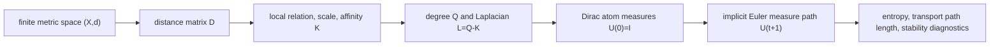
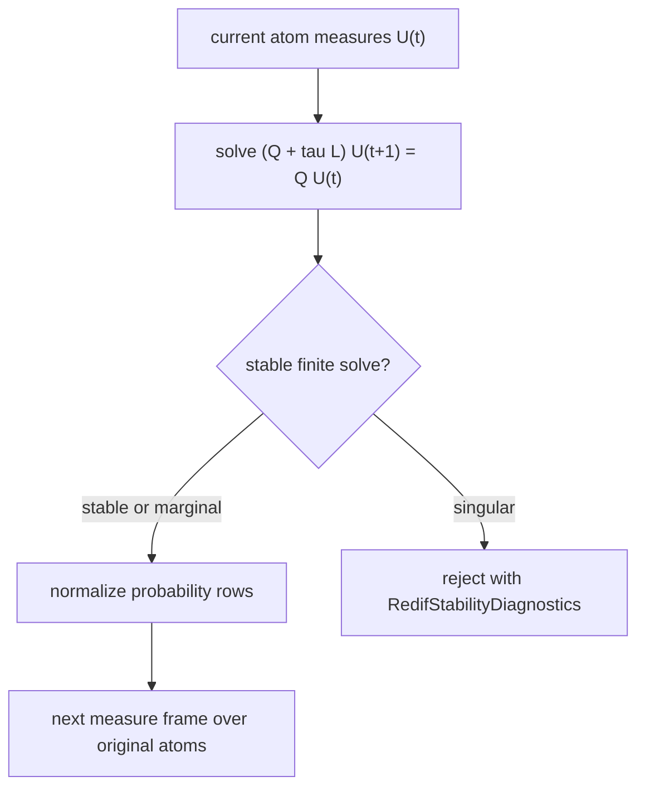

# Redif Metric Dynamics

Status: production contract with active hardening tracked in
`docs/engine/redif-dynamics-noise-plan.md`.

Redif is a metric-space dynamics operator. Its input is a finite metric space,
not a vector table and not an external probability model:

```text
X = {x_1, ..., x_n}
d: X x X -> R_{\ge 0}
```

Every state used by Redif is a measure over the atoms of `X`. For record `x_i`,
the initial state is the Dirac measure `delta_i`. This is what makes Redif
usable for arbitrary records: strings, histograms, process curves, mixed records,
or vector records all enter only through the admitted metric `d`.

## Local Redif Geometry

At Redif step `t`, the implementation has a distance matrix `D^(t)`.

- With fixed geometry, `D^(t) = d`.
- With adaptive geometry, `D^(t)` is the Wasserstein transport distance between
  the current atom measures, using the original metric `d` as ground distance.

For each atom `i`, let `N_k(i)` be the deterministic set of its `k` nearest
neighbours in `D^(t)`, excluding itself. Ties are resolved by record order. The
local distance relation is

```text
ell_ij = D^(t)_ij  if j in N_k(i) or i in N_k(j)
ell_ij = 0         otherwise
```

Redif then derives a local scale and a weighted affinity from this sparse
relation. The default local scale is

```text
sigma_i = mean({ell_ij : ell_ij > 0})     fallback: 1 when the row has no edge
```

The implementation also exposes three additional admitted scale policies:
median positive local distance, kth positive local distance, and one global mean
positive local distance shared by all atoms. The chosen policy is inspectable in
`RedifOperator.local_scale_policy`.

The Redif affinity is the self-tuned heat kernel on the local metric relation:

```text
K_ij  = exp(- ell_ij^2 / (sigma_i sigma_j))   when i and j are locally related
K_ij  = 0                                      otherwise
q_i   = sum_j K_ij
Q     = diag(q_i)
L     = Q - K
```

If two locally related atoms have zero distance, the operator affinity is `1`.
That lets the kernel be inspected on degenerate local relations. Full Redif
measure paths still use Wasserstein transport over the original ground distance,
so the source ground distance must be an admitted metric there: distinct atoms
must have positive distance.

`L` is the Redif graph Laplacian for the current finite metric geometry. It is
derived only from distances and deterministic neighbourhood order. Large
distances therefore never become large affinities; they contribute weakly to the
transition relation after the local scale is accounted for.

Degenerate isolated atoms receive an identity transition row. Algebraically this
is represented as a unit self-affinity for that atom, so the row remains a valid
probability transition and the Laplacian contribution is zero.

The same construction also defines the row-stochastic Redif transition

```text
P_ij = K_ij / q_i
```

with an identity row for a degenerate isolated atom. The C++ API exposes this
inspectable source operator as `redif_operator(space, options)`. The returned
`RedifOperator` contains `local_distances`, `local_scale`, `affinity`,
`degree`, `laplacian`, `transition`, `stationary`, the local relation mask, and
compact diagnostics for row sums, local scale range, affinity range, connected
components, reversibility, and the transition escape-probability proxy.

The escape-probability proxy is deliberately not advertised as an exact spectral
gap. It is

```text
gamma_escape = min_i (1 - P_ii)
```

for the row-stochastic Redif transition. It is cheap to compute from the finite
operator and is useful as a conservative audit signal: `0` means at least one
atom row is stationary under the current transition relation, while larger
values indicate that every atom has nonzero one-step mass escape. Exact
eigenvalue-based spectral gaps are not part of the public Redif result contract
yet.

## Inverse Redif Step

`redif_remove_noise(space, options)` applies the implicit Euler Redif step to the
matrix `U^(t)` whose row `i` is the current measure path for atom `x_i`:

```text
U^(0)     = I
U^(t+1)  = normalize_rows((Q + tau L)^(-1) Q U^(t))
```

Here `tau = options.euler_step`, with `0 < tau <= 1`. The linear solve is the
finite-dimensional implicit Euler equation

```text
Q (U^(t+1) - U^(t)) = - tau L U^(t+1)
```

This is the coordinate-free replacement for vector-record reconstruction. The
result is not a new record guessed in a coordinate chart; it is a path of atom
measures over the original finite metric space.





## Forward Noise Step

`redif_add_noise(space, options)` evolves Dirac atom measures by the same Redif
operator family:

```text
P_ij = A_ij / q_i                 row-stochastic Redif transition
F_tau = (1 - tau) I + tau P       explicit forward Euler
U^(t+1) = U^(t) F_tau
```

`F_tau` is a forward Euler step for the generator `P - I`. It adds disorder by
spreading atom mass through the metric relation. Forward noise and inverse Redif
share the same local distance relation, affinity, degree measure, transition,
step size, neighbourhood budget, and adaptive-geometry policy.

This does not mean every inverse request is automatically well posed. The
probability-preserving forward Euler step is bounded by `0 < tau <= 1`; an
algebraic reverse of a diffused measure must still pass the finite operator's
singularity and probability-measure checks.

## Generator And Time Discretization

For forward dynamics, the public finite-time step is

```text
F_tau = I + tau(P - I)
```

so the forward generator is `P - I`. For inverse metric dynamics,
`redif_remove_noise` uses the degree-weighted implicit Euler equation

```text
(Q + tau L) U^(t+1) = Q U^(t)
```

with `L = Q - K`. METRIC currently exposes these Euler/resolvent steps as the
checked finite operators. A matrix exponential or other exact continuous-time
operator is not part of the public Redif contract yet.

## Algebraic Forward-Step Inverse

For a fixed `RedifOperator`, METRIC also exposes the bounded one-step algebra:

```text
redif_forward_noise_step(op, U, tau) = U F_tau
redif_inverse_noise_step(op, V, tau) = U such that U F_tau = V
```

The inverse step solves

```text
F_tau^T u_i^T = v_i^T
```

for each atom-measure row. It is accepted only when the finite linear system is
nonsingular and the recovered rows are valid probability measures. For example,
in the canonical two-point space the inverse is singular at `tau = 1/2`, because
the forward matrix collapses both atom measures to the same row.

## Stability Diagnostics

Linear Redif solves report `RedifStabilityDiagnostics`. The current certificate
tracks the minimum and maximum absolute Gaussian-elimination pivots, their ratio,
and the singularity margin:

```text
singularity_margin = minimum_pivot_abs
```

The request is classified as:

- `stable` when the singularity margin is greater than the configured marginal
  tolerance;
- `marginal` when the margin is above the hard tolerance but not above the
  marginal tolerance;
- `singular` when the margin is at or below the hard tolerance.

The hard and marginal thresholds are explicit fields in `redif_options`.
`redif_inverse_noise_step` writes the singular diagnostics before throwing for a
singular algebraic inverse. `redif_remove_noise` records per-step stability in
`RedifMeasureResult.step_diagnostics`.

## Result Diagnostics

`RedifMeasureResult` carries enough metadata to audit the dynamics without
reconstructing private implementation state:

- `initial_stationary`: the stationary measure of the first Redif operator;
- `terminal_stationary`: the stationary measure of the final Redif operator;
- `operator_diagnostics`: one entry per step, including degree range, transition
  row-sum range, affinity range, scale range, connected components, and affinity
  symmetry, plus the transition escape-probability proxy;
- `entropy_diagnostics`: Shannon entropy and relative entropy before/after for
  every atom path;
- `step_diagnostics`: per-step stationary measure, entropy range, relative
  entropy to the current stationary measure, operator diagnostics, and stability;
- `transport_diagnostics`: ground-distance and exact transport metadata;
- `step_transport` and `transport_path_length`: Wasserstein movement of each
  atom measure under the original metric.

## Entropy Contract

For a measure `mu` over the atoms,

```text
H(mu) = - sum_i mu_i log(mu_i)
D(mu || pi) = sum_i mu_i log(mu_i / pi_i)
```

where `pi` is the invariant measure of the metric-derived transition. For the
forward Markov step, relative entropy to `pi` contracts under the standard
finite Markov-kernel conditions. Shannon entropy is guaranteed to increase only
under additional conditions such as a uniform invariant measure or a checked
canonical fixture. METRIC tests must state which entropy claim they are proving;
they must not treat entropy increase as unconditional for every non-uniform
finite metric space.

## Multiscale Transport Paths

`redif_multiscale_transport_paths(space, scales)` runs exact Redif inverse
measure dynamics over an explicit list of scale configurations. A scale
configuration is a complete `redif_options` value plus an audit label, so the
grid can vary neighbourhood count, Euler step, iteration count, local-scale
policy, and fixed versus adaptive geometry.

For each atom, the multiscale result preserves every per-scale transport path
length and reports three aggregates:

- median transport path length;
- maximum transport path length;
- stability-weighted path length.

The stability weight is derived from per-step Redif stability diagnostics. Stable
steps have weight `1`; marginal steps are weighted by their singularity margin
relative to the configured marginal tolerance; singular runs are rejected before
they become scores. The ranking default is the median transport path length,
with record identity order used only as a deterministic tie-breaker.

Multiscale rankings are statements about the audited scale grid, not universal
facts about every possible Redif parameter. METRIC keeps the per-scale path
lengths and stability weights so a user can see whether an atom is singular
across all checked scales or only under a narrow geometry choice. If adaptive
geometry changes the transport metric enough to make an inverse step marginal
or singular, that is a stability fact about the finite operator and must be
reported, not hidden behind a forced aggregate score.

## Scale And Exactness Boundary

Dense Redif is the reference implementation. It materializes the finite distance
matrix, derives the deterministic local relation, and computes exact discrete
Wasserstein distances for measure-path geometry. Dense budgets in
`redif_options` are refusal guards, not approximation switches.

METRIC also exposes an exact sparse local-relation operator. A caller may build
`RedifSparseOperator` from `RedifLocalRelationEntry` values or from an exact
neighbour provider. The contract is strict: each atom must provide exactly the
same directed `k` local relation that dense Redif would derive under the chosen
tie order. The operator symmetrizes that relation, derives the same local scales,
affinities, transition probabilities, and stationary measure, and can be
converted back to `RedifOperator` for dense-reference parity checks. Sparse
diagnostics report the relation representation, directed and symmetrized entry
counts, distance-evaluation count, and exactness.

If a caller has only a sampled or chunk-bounded candidate relation, Redif does
not claim exactness. `redif_remove_noise_from_sampled_distance_matrix(...)`
derives a local relation from deterministic bounded candidates and reports
`exact=false` with `non_exact_sampled_local_relation` diagnostics, including
candidate count, candidate universe, candidate fraction, chunk size, chunk
count, and local relation distance evaluations. This path approximates the
local relation only; the measure evolution and transport solve are still
reported separately.

Transport-path scaling is guarded independently. `max_transport_problems`
refuses exact path computation before metric calls when the requested number of
per-atom transport problems exceeds the configured budget. Full-support
transport remains exact. If `allow_transport_support_truncation` is enabled with
`max_transport_support_atoms` or `transport_support_mass_floor`, only the
reported transport path length uses truncated support. The result is marked
non-exact whenever positive mass is discarded, and
`RedifTransportDiagnostics` reports discarded mass, maximum discarded mass,
truncated measure count, support limits, and the exactness label.

## Path-Length Outlier Functional

For an atom path `mu_i^(0), ..., mu_i^(T)`, Redif reports

```text
path_length(i) = sum_t W_d(mu_i^(t), mu_i^(t+1))
```

where `W_d` is the discrete Wasserstein transport distance using the original
metric `d` as ground distance. A long path means the atom's measure must travel
far through the intrinsic metric before it participates in the evolving mass
structure. This is a metric-dynamics singularity score, not a downstream
decision-layer score.
It is invariant under record relabelling that preserves the finite metric
distance matrix.

The expected canonical behavior is:

- In a two-point space, one Redif inverse step with `tau = 1/4` and `k = 1`
  yields terminal measures `(5/6, 1/6)` and `(1/6, 5/6)`.
- In a compact chain plus one distant point, the distant point has the longest
  Redif transport path.
- In a clique-like equidistant space with full neighbourhoods, all atom path
  lengths are equal.
- In two compact chains connected by a weak bridge, the bridge atom has the
  longest Redif transport path under the checked canonical fixture.
- Across a checked multiscale grid on a compact line plus distant point, the
  distant point keeps the largest median Redif transport path.
- In non-vector spaces, the same path functional is valid because it only uses
  measures over atoms and the admitted metric.

## Relation To Other Singularity Diagnostics

Redif path length is not the same question as local volume, nearest-neighbour
isolation, or density-unassigned records.

- Local volume asks how much metric mass is near an atom at a chosen radius or
  neighbour count.
- Nearest-neighbour isolation asks how far an atom is from its closest metric
  witnesses.
- Density-unassigned records are produced by a concrete density grouping rule.
- Redif path length asks how far an atom measure travels under metric-induced
  dynamics before it participates in the evolving mass structure.

These diagnostics can agree on an isolated point, but they need not agree on a
bridge, a thin filament, or a space with nonuniform local volume. METRIC keeps
them separate so the user can inspect which metric-space principle produced the
singularity evidence.

## Failure Modes

Redif must reject or surface these cases instead of silently producing an
uninterpretable path:

- empty spaces;
- zero-neighbour requests on spaces with more than one atom;
- non-finite or out-of-range Euler steps;
- dense construction above the configured record budget;
- exact transport path computation above `max_transport_problems`;
- full-support transport requests with a smaller support budget unless
  support truncation is explicitly allowed;
- sampled/chunked local-relation paths that are accidentally treated as exact;
- singular implicit Euler systems;
- singular algebraic inverse requests, including the two-point `tau = 1/2`
  collapse;
- negative or non-finite measure mass after a solve;
- pseudometric ground distances when a full Wasserstein-backed Redif measure
  path is requested.

## Boundary To Other Procedures

`density_filter` is not Redif and is not noise removal. It filters records that
a concrete density grouping rule leaves unassigned.

Gaussian coordinate perturbation is a special case for vector records with a
particular coordinate metric. It is not the general definition of noise in a
finite metric space. In METRIC, noise is dynamics over the intrinsic metric, and
noise removal is inverse metric dynamics.
