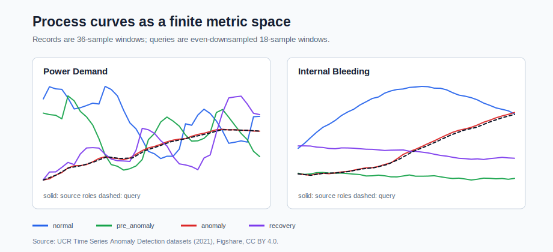
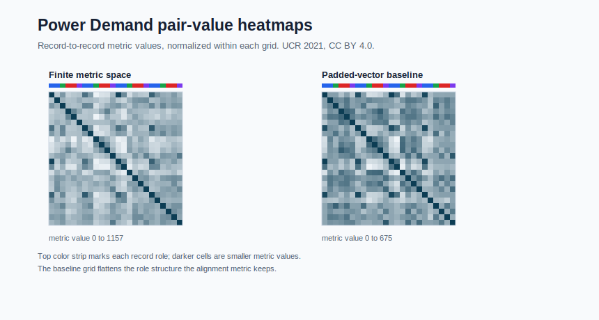
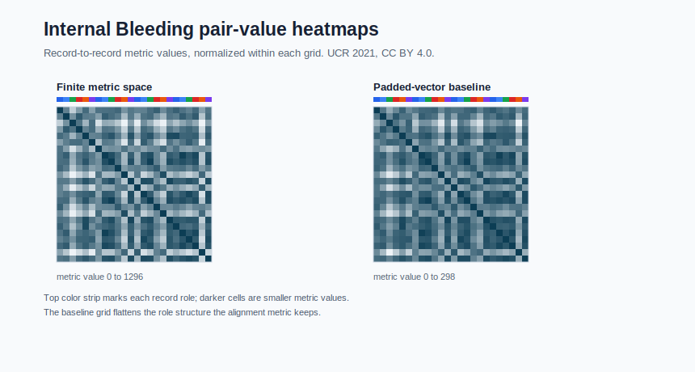
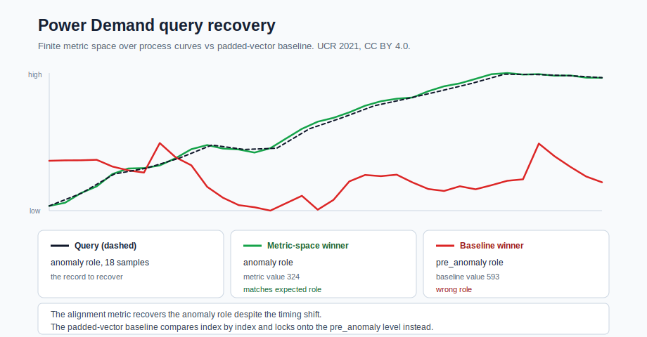
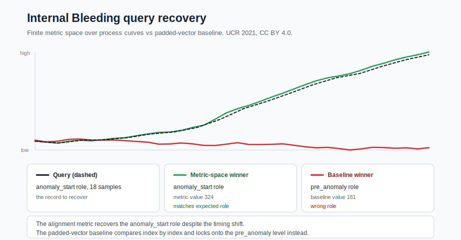
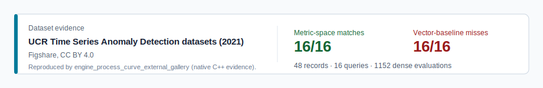

# Process Curve External Gallery

This is the first public hero application for METRIC: real, licensed process
windows turned into a finite metric space, where a curve metric recovers the
right operating condition that a padded point-vector comparison misses. Every
number and figure on this page is produced by one checked-in native C++
executable.



## What are the records?

Each record is a 36-sample process window from the licensed UCR anomaly dataset,
kept in its native curve form. Two domains are used:

- **Power Demand** — 24 windows with roles `normal`, `pre_anomaly`, `anomaly`,
  and `recovery`.
- **Internal Bleeding** — 24 windows with roles `normal`, `normal_mid`,
  `pre_anomaly`, `anomaly_start`, `anomaly_mid`, and `recovery`.

A query is an even-downsampled 18-sample window taken from an anomaly-onset or
recovery record. Downsampling shifts and locally stretches the timing, so a
query is no longer index-aligned with its source window. There are 8 queries per
domain, 16 in total.

## What is the metric?

The metric value between two records is computed by a curve-alignment metric. It
aligns the two windows with substitution, deletion, and gap (insertion) steps
and returns the smallest aligned recoding effort between them. That value can be
read as an alignment cost, but the primitive is a metric value over a record
pair, not a coordinate difference.

The baseline is a padded-vector metric value over the same records: it pads the
shorter curve with zeros to equal length and compares the two curves index by
index. Both are metric values on the identical record set; only the metric
differs, which is what makes the comparison a fair baseline rather than a
different problem.

## What does the finite space compute?

A record set plus one metric is a finite metric space. For each domain METRIC
materializes the dense source space — every record-to-record metric value, which
is 24 × 24 = 576 evaluations per domain and 1152 across both. The two grids
below show the same records under the curve metric (left) and under the
padded-vector baseline (right). The alignment metric keeps the role structure
that the padded-vector baseline flattens.





## Which query does the metric space recover?

A nearest-record query in the finite metric space returns the source window with
the matching role for all 16 queries across both domains. The dashed query curve
tracks the metric-space winner (green) far more closely than the padded-vector
baseline winner (red).





The first query in each domain:

- Power Demand: `downsampled_power_demand_044_anomaly_start_18485` recovers
  `power_demand_044_anomaly_start_18485` (`anomaly` role) at metric value 324.
- Internal Bleeding: `downsampled_internal_bleeding_026_anomaly_start_5684`
  recovers `internal_bleeding_026_anomaly_start_5684` (`anomaly_start` role) at
  metric value 324.

## Which query does the vector baseline miss?

Under the padded-vector baseline the same queries return a window with the wrong
role for all 16 queries. Both first queries are pulled to a `pre_anomaly`
window, because index-by-index comparison of padded curves rewards similar raw
level over a matching role:

- Power Demand: baseline winner `power_demand_045_pre_anomaly_23152`
  (`pre_anomaly` role) at baseline value 592.967.
- Internal Bleeding: baseline winner `internal_bleeding_026_pre_anomaly_5479`
  (`pre_anomaly` role) at baseline value 180.819.

The average metric margin — the baseline winner's metric value minus the
metric-space winner's metric value, both read under the alignment metric — is
370.005 for Power Demand and 345.164 for Internal Bleeding. The metric-space
winner is the closer record by a wide margin in every query.

## Where do the C++ evidence files live?



The executable also writes the full evidence as static assets when run with an
export directory:

```bash
build/core/examples/engine/engine_process_curve_external_gallery \
  --export-dir docs/examples/assets/process-curve-external
```

The export reproduces every figure and table on this page under
[`assets/process-curve-external`](assets/process-curve-external):

- [`summary.csv`](assets/process-curve-external/summary.csv) — one row per
  domain with record/query counts, metric matches, baseline misses, average
  metric margin, and dense evaluations.
- [`records.csv`](assets/process-curve-external/records.csv) — one row per source
  window with its role label and sample values.
- [`queries.csv`](assets/process-curve-external/queries.csv) — one row per query
  with the metric-space winner, padded-vector baseline winner, metric values,
  margin, and role-correctness flags.
- [`distances.csv`](assets/process-curve-external/distances.csv) — every
  record-pair metric value for both representations (`metric_space` and
  `padded_vector_baseline`).
- [`query-winners.csv`](assets/process-curve-external/query-winners.csv) — the
  query, metric-space winner, and baseline winner curves per query.

Default behavior is unchanged: running the executable with no arguments prints
the deterministic text report below and returns nonzero on a failed assertion.

## Source

The checked-in sample comes from the Figshare dataset:

- UCR Time Series Anomaly Detection datasets (2021)
- DOI: https://doi.org/10.6084/m9.figshare.26410744.v1
- Figshare article:
  https://figshare.com/articles/dataset/UCR_Time_Series_Anomaly_Detection_datasets_2021_/26410744
- License: CC BY 4.0
- Citation: Lee, Daesoo (2024). UCR Time Series Anomaly Detection datasets
  (2021). figshare. Dataset. https://doi.org/10.6084/m9.figshare.26410744.v1

The Figshare metadata provides a stable source archive id (`48036268`) and MD5
(`4740e64e7a3242773b4570c1537095c1`). The full source archive is about 94 MB
and is intentionally not checked into the repository.

## Repository Slice

The local data slices and per-domain figures are:

- [Power Demand Gallery CSV](../../examples/engine/assets/process_curve_power_demand_gallery.csv)
- [Power Demand Attribution And License Note](../../examples/engine/assets/process_curve_power_demand_gallery_license.md)
- [Internal Bleeding Gallery CSV](../../examples/engine/assets/process_curve_internal_bleeding_gallery.csv)
- [Internal Bleeding Attribution And License Note](../../examples/engine/assets/process_curve_internal_bleeding_gallery_license.md)
- [Exported evidence directory](assets/process-curve-external)

The PowerDemand CSV contains 24 36-sample windows from four source files:

```text
044_UCR_Anomaly_DISTORTEDPowerDemand1_9000_18485_18821.txt
045_UCR_Anomaly_DISTORTEDPowerDemand2_14000_23357_23717.txt
046_UCR_Anomaly_DISTORTEDPowerDemand3_16000_23405_23477.txt
047_UCR_Anomaly_DISTORTEDPowerDemand4_18000_24005_24077.txt
```

The InternalBleeding CSV contains another 24 36-sample windows from four source
files:

```text
026_UCR_Anomaly_DISTORTEDInternalBleeding15_1700_5684_5854.txt
028_UCR_Anomaly_DISTORTEDInternalBleeding17_1600_3198_3309.txt
029_UCR_Anomaly_DISTORTEDInternalBleeding18_2300_4485_4587.txt
031_UCR_Anomaly_DISTORTEDInternalBleeding20_2700_5759_5919.txt
```

Values are copied without smoothing or rescaling. The labels identify source
window roles for the benchmark narration.

## Executable Benchmark

Command:

```bash
build/core/examples/engine/engine_process_curve_external_gallery
```

Expected output:

```text
process external source = UCR_Time_Series_Anomaly_Detection_2021
process external license = CC BY 4.0
process external domains = 2
process external records = 48
process external queries = 16
process external power_demand records = 24
process external power_demand queries = 8
process external power_demand metric correct = 8/8
process external power_demand vector mismatches = 8/8
process external power_demand average metric margin = 370.005
process external power_demand first query = downsampled_power_demand_044_anomaly_start_18485
process external power_demand first metric winner = power_demand_044_anomaly_start_18485 at 324
process external power_demand first vector winner = power_demand_045_pre_anomaly_23152 at 592.967
process external power_demand dense evaluations = 576
process external internal_bleeding records = 24
process external internal_bleeding queries = 8
process external internal_bleeding metric correct = 8/8
process external internal_bleeding vector mismatches = 8/8
process external internal_bleeding average metric margin = 345.164
process external internal_bleeding first query = downsampled_internal_bleeding_026_anomaly_start_5684
process external internal_bleeding first metric winner = internal_bleeding_026_anomaly_start_5684 at 324
process external internal_bleeding first vector winner = internal_bleeding_026_pre_anomaly_5479 at 180.819
process external internal_bleeding dense evaluations = 576
process external dense evaluations = 1152
```

Interpretation:

- each query is a downsampled version of an anomaly-start or recovery
  process-window in its own domain slice
- the alignment metric recovers the expected source-window role for all 16
  queries across the two domains
- the padded vector baseline misses the expected role for all 16 queries
  because it treats shorter curves as point vectors padded with zeros
- dense cost is explicit: each 24-window domain materializes 24 x 24
  source-window metric values

## Dataset Selection Note

NASA C-MAPSS remains a strong future candidate for industrial predictive
maintenance demos, but the NASA Open Data Portal currently lists the relevant
CMAPSS Jet Engine Simulated Data page as `License not specified`. For this
documented demo, the Figshare/UCR source is used because the license is explicit.

## Next Hero Package

The next external-gallery step adds a mixed industrial record domain: typed
fields, a composed metric, representatives, structure, and a vector baseline
miss, following the same native-C++-evidence pattern used here.
