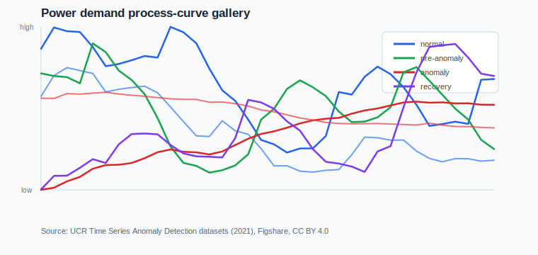
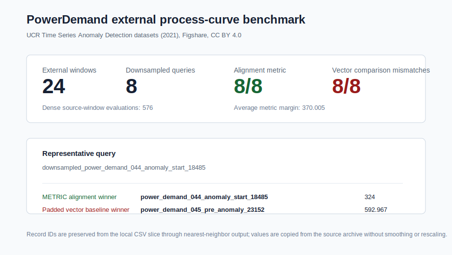
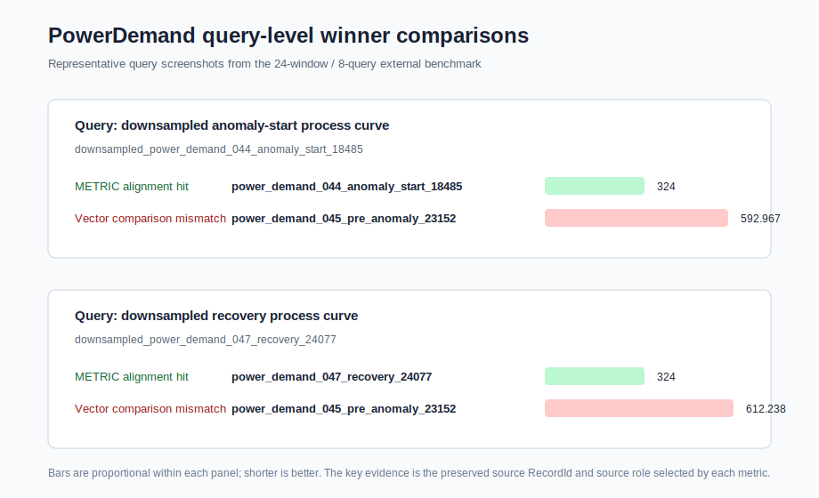
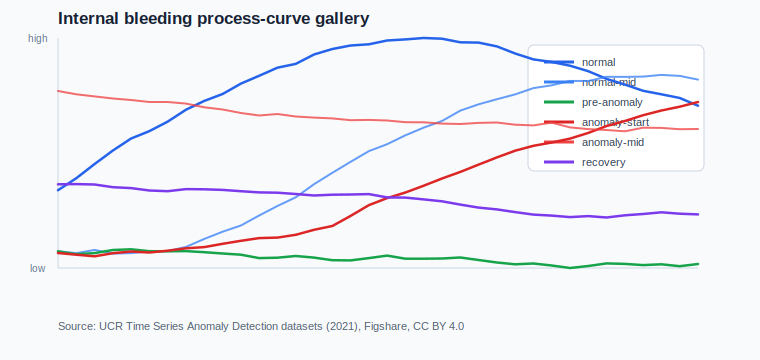
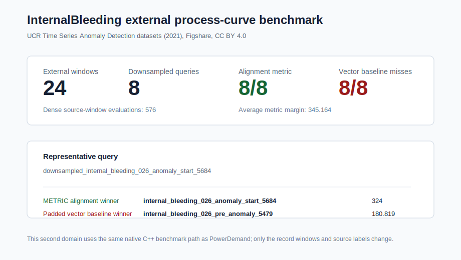

# Process Curve External Gallery

This page records the first licensed external data slices for the process-curve
hero workflow.











## Source

The checked-in sample comes from the Figshare dataset:

- UCR Time Series Anomaly Detection datasets (2021)
- DOI: https://doi.org/10.6084/m9.figshare.26410744.v1
- Figshare article:
  https://figshare.com/articles/dataset/UCR_Time_Series_Anomaly_Detection_datasets_2021_/26410744
- License: CC BY 4.0
- Citation: Lee, Daesoo (2024). UCR Time Series Anomaly Detection datasets
  (2021). figshare. Dataset. https://doi.org/10.6084/m9.figshare.26410744.v1

The Figshare metadata provides a stable source archive id (`48036268`) and MD5
(`4740e64e7a3242773b4570c1537095c1`). The full source archive is about 94 MB
and is intentionally not vendored.

## Repository Slice

The local slice is:

- [Power Demand Gallery CSV](../../examples/engine/assets/process_curve_power_demand_gallery.csv)
- [Power Demand Attribution And License Note](../../examples/engine/assets/process_curve_power_demand_gallery_license.md)
- [Power Demand Gallery SVG](assets/process-curve-power-demand-gallery.svg)
- [Power Demand Benchmark Report SVG](assets/process-curve-power-demand-report.svg)
- [Power Demand Query Winner Comparison SVG](assets/process-curve-power-demand-query-winners.svg)
- [Internal Bleeding Gallery CSV](../../examples/engine/assets/process_curve_internal_bleeding_gallery.csv)
- [Internal Bleeding Attribution And License Note](../../examples/engine/assets/process_curve_internal_bleeding_gallery_license.md)
- [Internal Bleeding Gallery SVG](assets/process-curve-internal-bleeding-gallery.svg)
- [Internal Bleeding Benchmark Report SVG](assets/process-curve-internal-bleeding-report.svg)

The PowerDemand CSV contains 24 36-sample windows from four source files:

```text
044_UCR_Anomaly_DISTORTEDPowerDemand1_9000_18485_18821.txt
045_UCR_Anomaly_DISTORTEDPowerDemand2_14000_23357_23717.txt
046_UCR_Anomaly_DISTORTEDPowerDemand3_16000_23405_23477.txt
047_UCR_Anomaly_DISTORTEDPowerDemand4_18000_24005_24077.txt
```

Window roles:

- eight normal windows
- four pre-anomaly windows
- eight anomaly windows
- four recovery windows

The InternalBleeding CSV contains another 24 36-sample windows from four source
files:

```text
026_UCR_Anomaly_DISTORTEDInternalBleeding15_1700_5684_5854.txt
028_UCR_Anomaly_DISTORTEDInternalBleeding17_1600_3198_3309.txt
029_UCR_Anomaly_DISTORTEDInternalBleeding18_2300_4485_4587.txt
031_UCR_Anomaly_DISTORTEDInternalBleeding20_2700_5759_5919.txt
```

Window roles:

- four normal windows
- four normal-mid windows
- four pre-anomaly windows
- four anomaly-start windows
- four anomaly-mid windows
- four recovery windows

Values are copied without smoothing or rescaling. The labels identify source
window roles for the benchmark narration.

## Executable Benchmark

Command:

```bash
build/core/examples/engine/engine_process_curve_external_gallery
```

Expected output:

```text
process external source = UCR_Time_Series_Anomaly_Detection_2021
process external license = CC BY 4.0
process external domains = 2
process external records = 48
process external queries = 16
process external power_demand records = 24
process external power_demand queries = 8
process external power_demand metric correct = 8/8
process external power_demand vector mismatches = 8/8
process external power_demand average metric margin = 370.005
process external power_demand first query = downsampled_power_demand_044_anomaly_start_18485
process external power_demand first metric winner = power_demand_044_anomaly_start_18485 at 324
process external power_demand first vector winner = power_demand_045_pre_anomaly_23152 at 592.967
process external power_demand dense evaluations = 576
process external internal_bleeding records = 24
process external internal_bleeding queries = 8
process external internal_bleeding metric correct = 8/8
process external internal_bleeding vector mismatches = 8/8
process external internal_bleeding average metric margin = 345.164
process external internal_bleeding first query = downsampled_internal_bleeding_026_anomaly_start_5684
process external internal_bleeding first metric winner = internal_bleeding_026_anomaly_start_5684 at 324
process external internal_bleeding first vector winner = internal_bleeding_026_pre_anomaly_5479 at 180.819
process external internal_bleeding dense evaluations = 576
process external dense evaluations = 1152
```

Interpretation:

- each query is a downsampled version of an anomaly-start or recovery
  process-window in its own domain slice
- the alignment metric recovers the expected source-window role for all 16
  queries across the two domains
- the padded vector baseline misses the expected role for all 16 queries
  because it treats shorter curves as point vectors padded with zeros
- dense cost is explicit: each 24-window domain materializes 24 x 24
  source-window distance evaluations

## Dataset Selection Note

NASA C-MAPSS remains a strong future candidate for industrial predictive
maintenance demos, but the NASA Open Data Portal currently lists the relevant
CMAPSS Jet Engine Simulated Data page as `License not specified`. For this
documented demo, the Figshare/UCR source is used because the license is explicit.

## Next Work

The next external-gallery step is to add a third licensed domain only if it
adds a materially different metric story. The active production queue can now
move back to engine-pipeline composition work.
